### 项目介绍

因为本人在网上找不到 AI 智能化项目的相关 Web 代码和解决方案，所以本项目采用 UmiMax+Ant Design+Ant Design X 实现承载 AI 智能化管理系统解决方案，功能简单，无后端支持，仅仅是一个能根据 AI Tools 处理系统功能的基础解决方案，此系统代码仅供参考！

### 主要功能

本系统主要基于 Ant Design X 组件库编写一套 Chat 对话功能，大部分代码用于实现并搭建 AI 对话功能和利用 AI Tools 实现 AI**半自动**命令执行功能。

**功能主要实现**：系统操作者可通过和 AI 对话后，触发开发者在 Tools 中定义的 AI 关键词(description)，自动执行开发者定义的工作流程(局部/全局)，详情展示见截图。

**系统如何执行 AI 对话中的命令**：代码中主要分为局部执行 AI 命令`(useChatEvent)`和全局执行 AI 命令`(useGlobalChatEvent)`，开发者可参考代码示例使用

目前项目仅支持 Qwen 千问的 Api 调用

框架环境

node：v18.16.0

pnpm：v9.15.2

安装命令

```sh
npm install
或
pnpm install
```

启动命令

```shell
npm run start
或
pnpm run start
或
yarn start
```

### JSON Schema

如果你不太了解 Tools 中 JSON 书写规范，你可以去查阅[JSON Schema](https://json-schema.apifox.cn/)文档并结合[Tools](https://help.aliyun.com/zh/model-studio/qwen-function-calling)使用方式实践到项目中，这不会花费你太多的时间去了解

### 提示

1、初次使用项目请先在`.env.ts`代码中填入自己的 ApiKey

```js
export default {
  "process.env.API_BASE_URL": "", // 忽略即可
  "process.env.DEEPSEEK_API_KEY": "your key", // deepseek apikey
  "process.env.QWEN_API_KEY": "your key", // 通一千问 apikey
};
```

2、如果没有 Apikey，请搜索教程注册并申请。如已申请 ApiKey 请点击如下地址跳转

通义千问 ApiKey 查询：https://bailian.console.aliyun.com/?tab=model#/api-key

3、在系统中看到的接口请求全部为前端模拟的请求，并非真实的后端请求

### 目前已有功能列表
**AI类**
- 深度思考、联网搜索、重新生成、文件解析
- 多个AI角色
- 指令中心
- 支持Iframe数据交互
- 存储用户提出的问题
- 命令列表、重复执行过命令
- 自动对话（实验性）
- 聊天室（实验性，可AI辅助聊天）

**系统类（支持AI辅助）**
- 页面跳转
- 修改系统名称
- 创建组件
- 图表生成
- 图表修改
- 用户管理：增删改查、导出用户数据
- 订单管理：增删改查、导出订单数据
- 角色管理：查询、导出角色数据
- 解析文件并将文件数据应用到系统中
- 表单实时赋值


### 部分功能展示
### AI类
**文件解析**
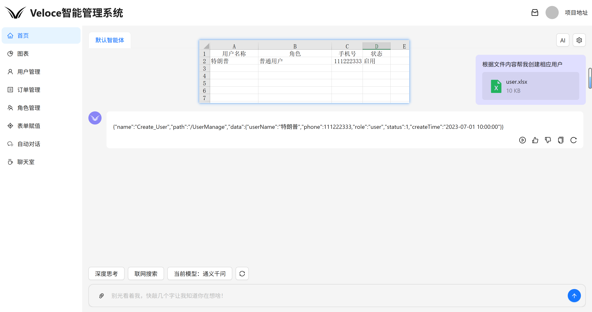

**多个AI角色**
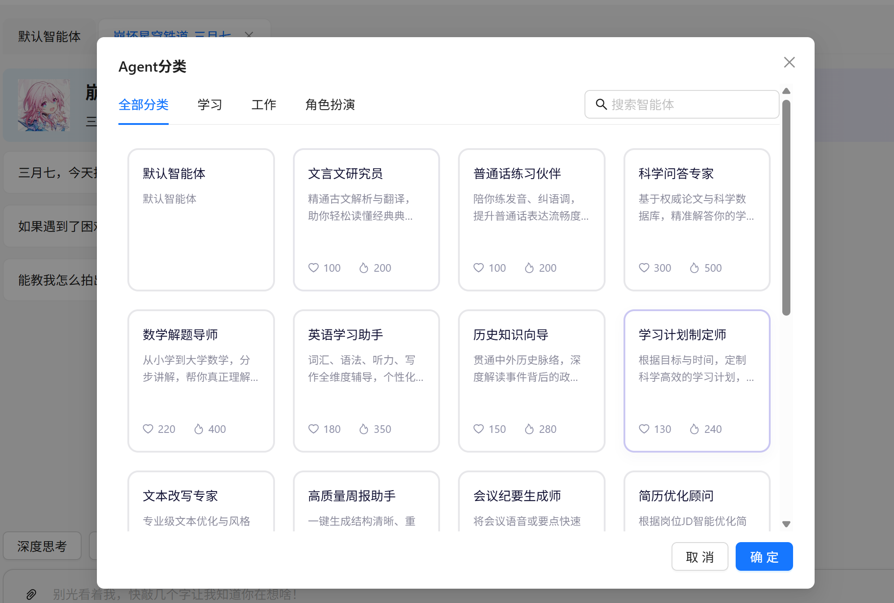
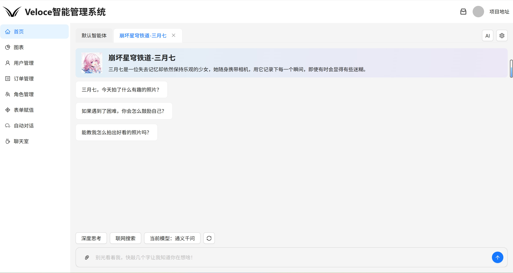

**指令中心**
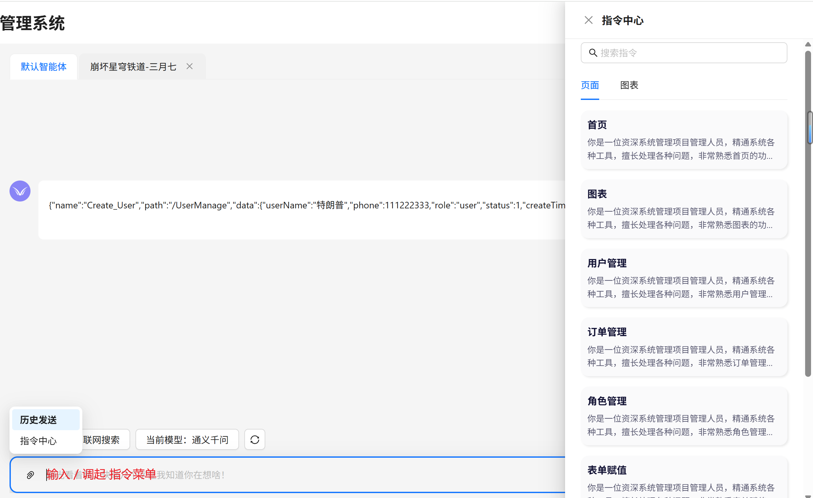

**存储用户提出的问题**
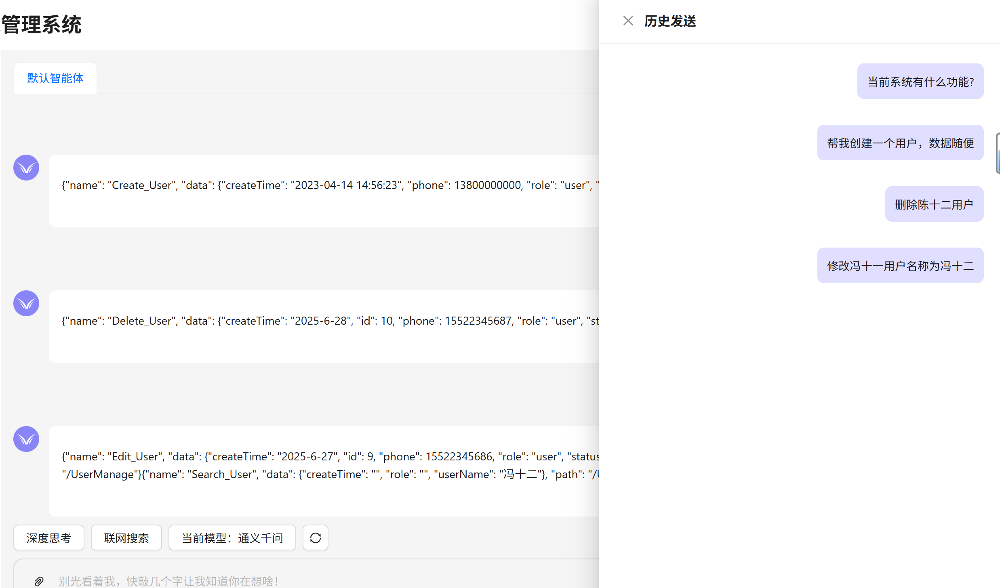

**命令列表**
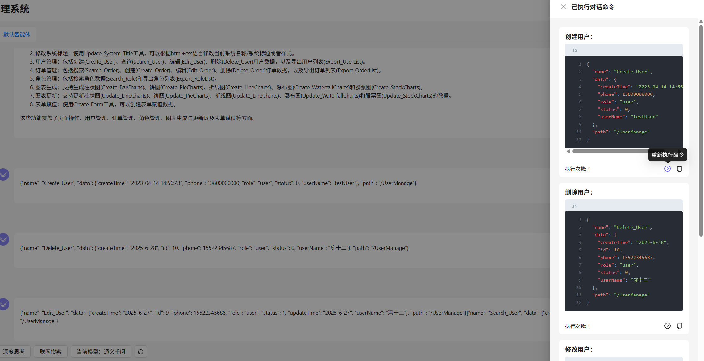

****

### 系统类
**修改系统名称**
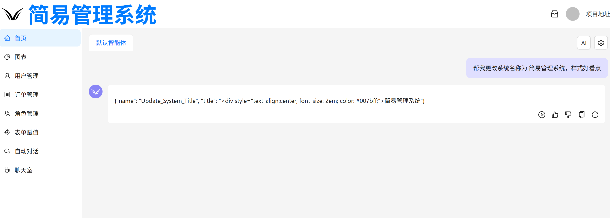

**页面跳转**
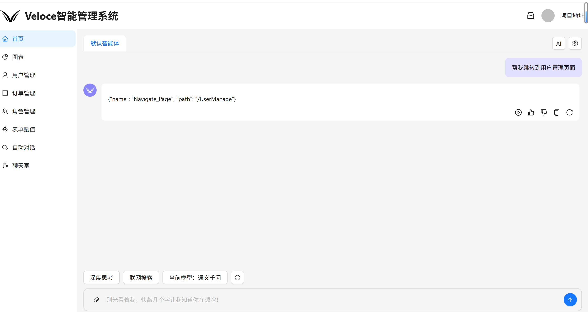

**生成图表**
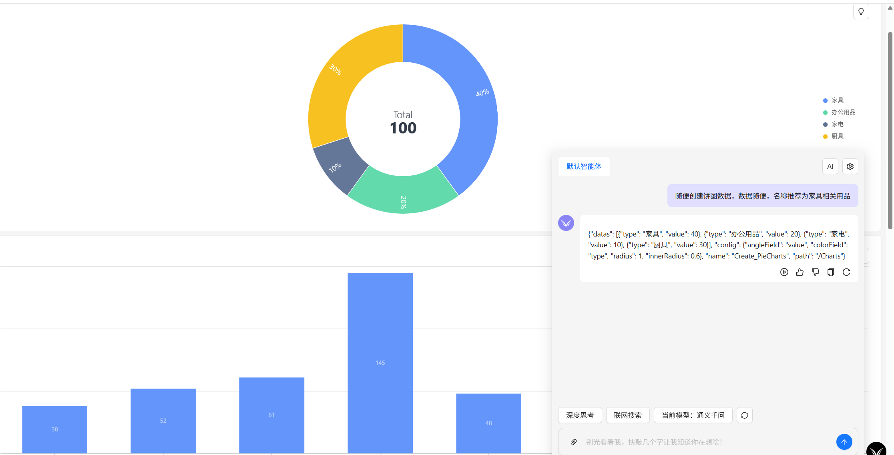

**图表修改**
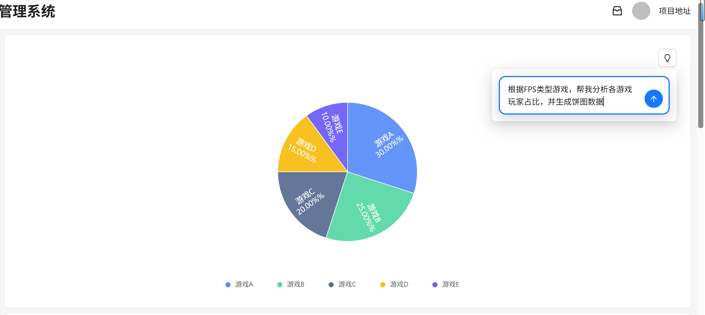

**用户管理：支持增删改查**
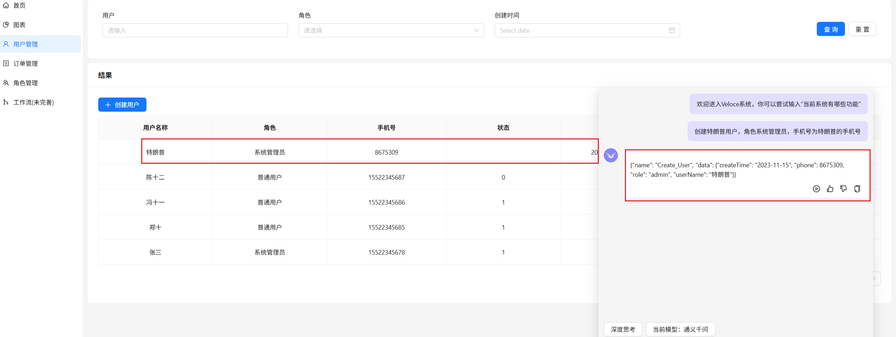
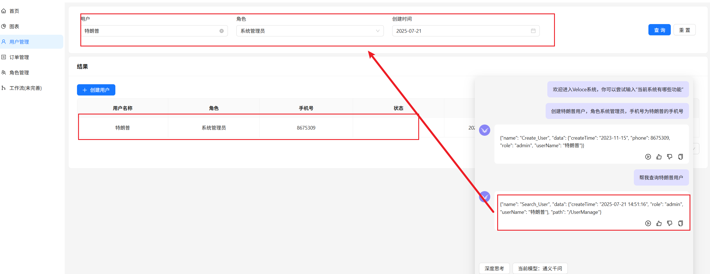

**订单管理：支持增删改查**
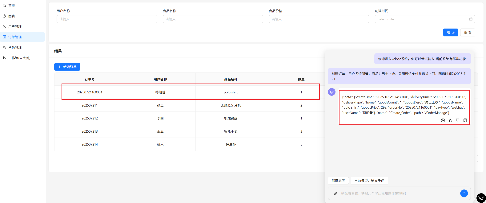
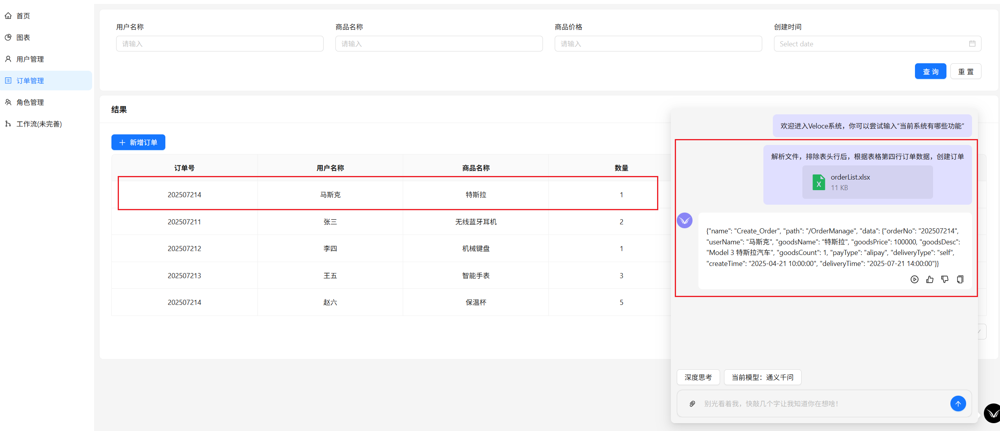

**表单实时赋值**
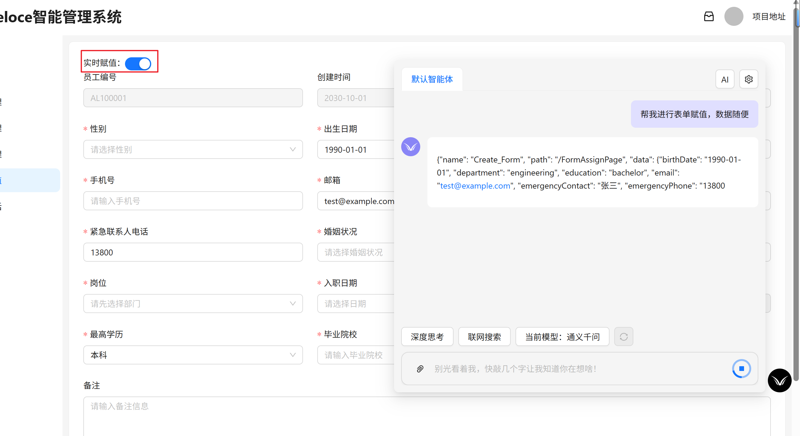

### 扩展
**支持Iframe数据交互**
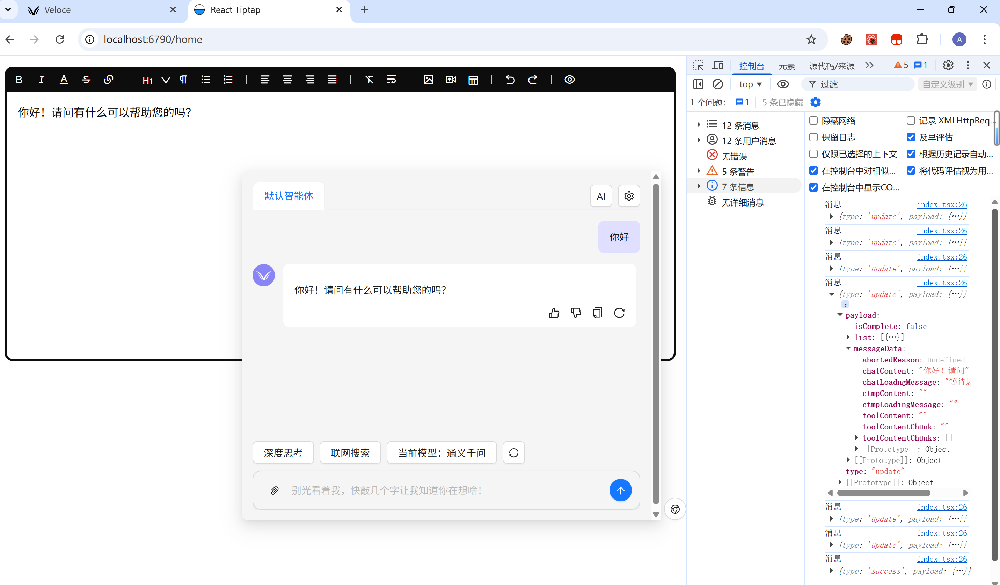

**本系统还支持两个 AI 之间的对话，让对话不再局限于人与 AI，而是 AI 与 AI**
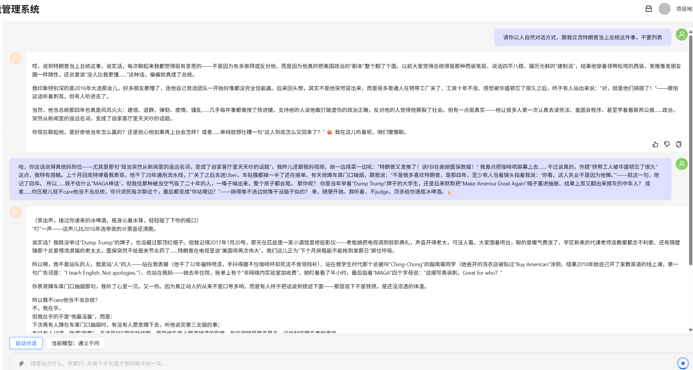

**聊天室（实验性，可AI辅助聊天）**
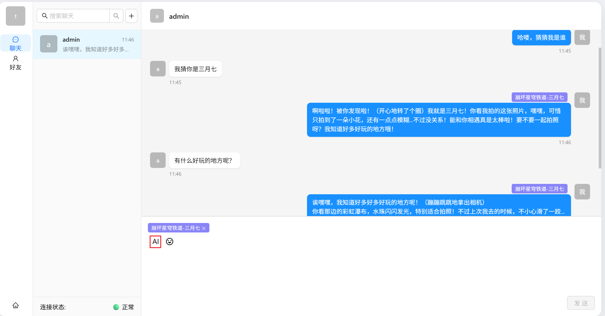
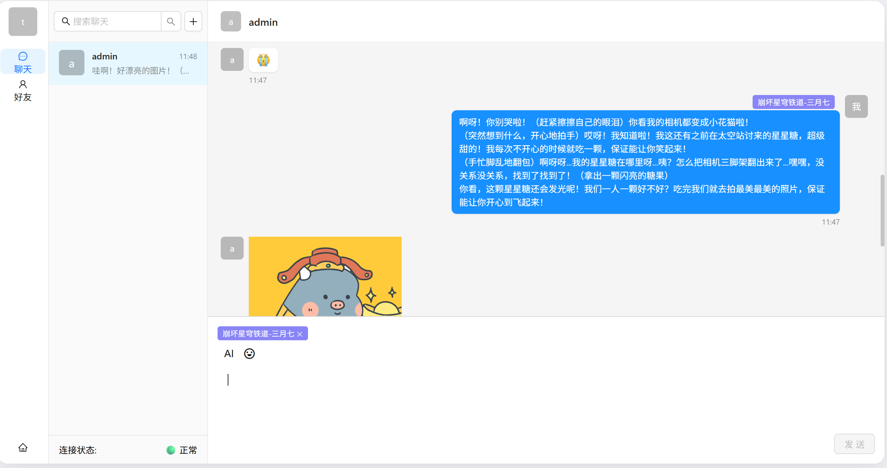
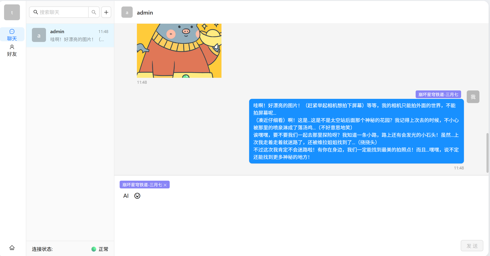