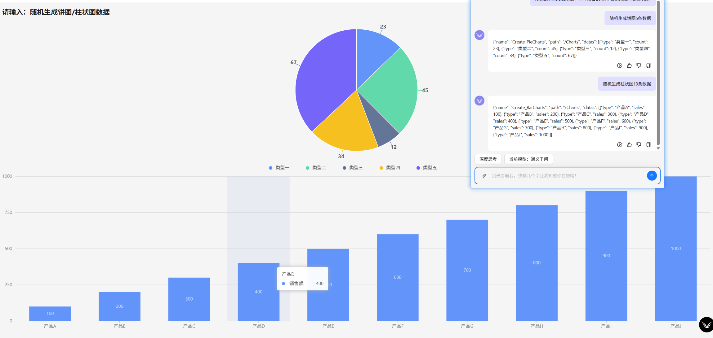
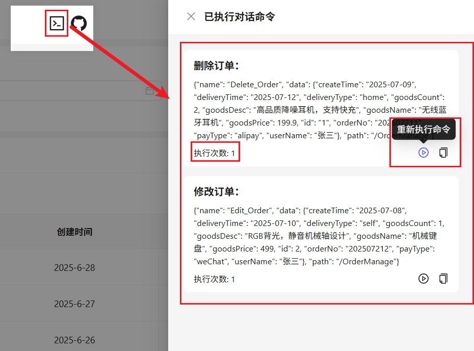

### 项目介绍 (master 为测试分支，建议切换到 ai-main 分支运行项目)

因为本人在网上找不到 AI 智能化项目的相关 Web 代码和解决方案，所以本项目采用 UmiMax+Ant Design+Ant Design X 实现承载 AI 智能化管理系统解决方案，功能简单，无后端支持，仅仅是一个能根据 AI Tools 处理系统功能的基础解决方案，此系统代码仅供参考！

### 主要功能

本系统主要基于 Ant Design X 组件库编写一套 Chat 对话功能，大部分代码用于实现并搭建 AI 对话功能和利用 AI Tools 实现 AI**半自动**命令执行功能。

**功能主要实现**：系统操作者可通过和 AI 对话后，触发开发者在 Tools 中定义的 AI 关键词(description)，自动执行开发者定义的工作流程(局部/全局)，详情展示见截图。

**系统如何执行 AI 对话中的命令**：代码中主要分为局部执行 AI 命令`(useChatEvent)`和全局执行 AI 命令`(useGlobalChatEvent)`，开发者可参考代码示例使用

目前项目仅支持 Qwen 通义千问`(代码较为完善，系统推荐使用)`和 DeepSeek`(代码完善中,不推荐使用)`的 Api 调用

框架环境

node：v18.16.0

pnpm：v9.15.2

安装命令

```sh
npm install
或
pnpm install
```

启动命令

```shell
npm run start
或
pnpm run start
或
yarn start
```
### JSON Schema
如果你不太了解Tools中JSON书写规范，你可以去查阅[JSON Schema](https://json-schema.apifox.cn/)文档并结合[Tools](https://api-docs.deepseek.com/zh-cn/api/create-chat-completion)使用方式实践到项目中，这不会花费你太多的时间去了解

### 提示

1、初次使用项目请先在`.env.ts`代码中填入自己的 ApiKey

```js
export default {
  "process.env.API_BASE_URL": "", // 忽略即可
  "process.env.DEEPSEEK_API_KEY": "your key", // deepseek apikey
  "process.env.QWEN_API_KEY": "your key", // 通一千问 apikey
};
```

2、如果没有 Apikey，请搜索教程注册并申请。如已申请 ApiKey 请点击如下地址跳转

DeepSeek ApiKey 查询：https://platform.deepseek.com/api_keys

通义千问 ApiKey 查询：https://bailian.console.aliyun.com/?tab=model#/api-key

3、在系统中看到的接口请求全部为前端模拟的请求，并非真实的后端请求

### 部分功能展示截图：

**创建组件**


**生成图表：目前仅支持饼图**


**用户管理：支持增删改查**


**订单管理：支持增删改查**


**执行列表：记录执行过的命令，可再次重复执行**



### 扩展

**本系统还支持两个 AI 之间的对话，让对话不再局限于人与 AI，而是 AI 与 AI**


