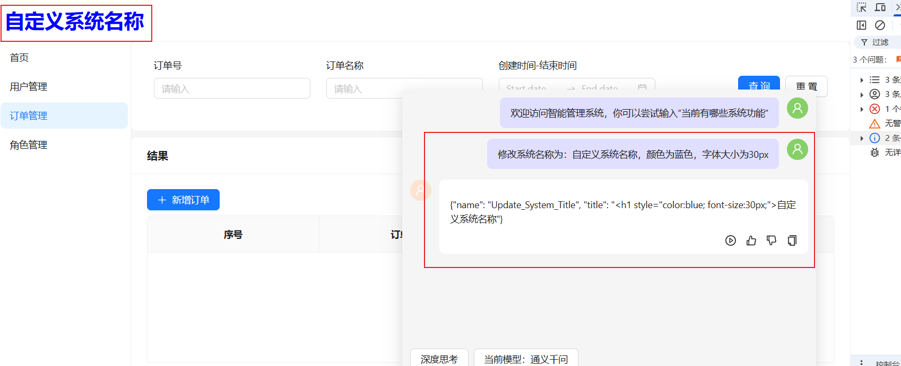

### 项目介绍

因为本人在网上找不到AI智能化项目的相关Web代码和解决方案，所以本项目采用UmiMax+Ant Design+Ant Design X 实现承载AI智能化管理系统解决方案，功能简单，无后端支持，仅仅是一个能根据AI Tools处理系统功能的基础解决方案，此系统代码仅供参考！

### 主要功能

本系统主要基于Ant Design X组件库编写一套Chat对话功能，大部分代码用于实现并搭建AI对话功能和利用AI Tools实现AI**半自动**命令执行功能。

**功能主要实现**：系统操作者可通过和AI对话后，触发开发者在Tools中定义的AI关键词(description)，自动执行开发者定义的工作流程(局部/全局)，详情展示见截图。

**系统如何执行AI对话中的命令**：代码中主要分为局部执行AI命令`(useChatEvent)`和全局执行AI命令`(useGlobalChatEvent)`，开发者可参考代码示例使用

**待优化项**：当前系统还不支持执行一连串的工作命令执行，并且所有指令的执行均需代码中手动配置，AI解读后方可准确执行，后续可能会优化再度代码。

目前项目仅支持Qwen通义千问`(代码较为完善，系统推荐使用)`和DeepSeek`(代码完善中,不推荐使用)`的Api调用

框架环境

node：v18.16.0

pnpm：v9.15.2

安装命令

```sh
npm install
或
pnpm install
```

启动命令

```shell
npm run start
或
pnpm run start
或
yarn start
```

### 提示

1、初次使用项目请先在`.env.ts`代码中填入自己的ApiKey

```js
export default {
  "process.env.API_BASE_URL": "", // 忽略即可
  "process.env.DEEPSEEK_API_KEY": "your key", // deepseek apikey
  "process.env.QWEN_API_KEY": "your key", // 通一千文 apikey
};
```

2、如果没有Apikey，请搜索教程注册并申请。如已申请ApiKey请点击如下地址跳转

DeepSeek ApiKey查询：https://platform.deepseek.com/api_keys

通义千文 ApiKey查询：https://bailian.console.aliyun.com/?tab=model#/api-key

**页面首次进入白屏解决方案**：地址栏手动加上/main，作者很懒，没加重定向

### 部分功能展示截图：


